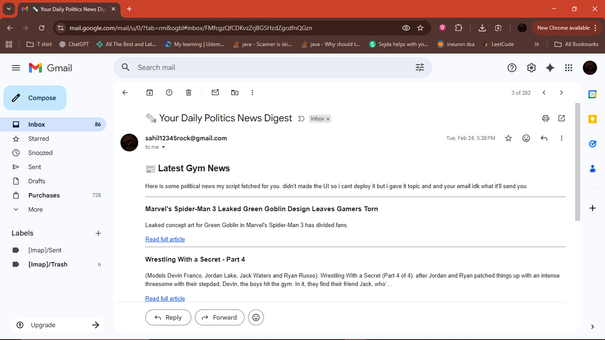

# 📰 Email News Automation (Python)

A Python-based automation script that fetches the latest news on a given topic using **NewsAPI** and sends a **formatted HTML email digest** directly to the user.

This project demonstrates real-world automation by combining **API integration, data processing, and email delivery**.

---

## ✨ Features

### 1. Fetch Latest News

Retrieves recent news articles based on a chosen topic using NewsAPI.

### 2. Dynamic Topic Selection

Users can define a topic (e.g., "gym", "technology", "AI") to receive relevant news updates.

### 3. HTML Email Formatting

Articles are structured into a clean HTML email format for better readability.

### 4. Automated Email Delivery

Sends the news digest directly to the user using Gmail SMTP.

---

## 🧠 How It Works

1. Load environment variables (`EMAIL`, `PASSWORD`, `API_KEY`)
2. Send request to NewsAPI with a topic
3. Parse the response JSON
4. Extract top 5 articles
5. Format them into an HTML email
6. Send email using SMTP

---

## 📸 Email Preview

Below is an example of the automated news email sent by the script:



---

## 📁 Project Structure

email-news-automation/
│
├── main.py
├── .env
├── screenshots/
│   └── email-preview.png
└── README.md

---

## 🔑 Environment Variables

Create a `.env` file in your project directory:

EMAIL=[your_email@gmail.com](mailto:your_email@gmail.com)
PASSWORD=your_app_password
API_KEY=your_newsapi_key

> ⚠️ Use a Gmail **App Password**, not your actual password.

---

## 💻 Example Code Snippet

```python
for article in content['articles'][0:5]:
    myArticle += f"""
    <h3>{article['title']}</h3>
    <p>{article.get('description', 'No description available.')}</p>
    <a href="{article['url']}">Read full article</a>
    <hr>
    """
```

---

## 📧 Example Output

The email contains:

* Top 5 latest news articles
* Article title
* Short description
* Clickable link to full article

---

## ⚙️ How to Run

### 1. Install dependencies

pip install requests python-dotenv

---

### 2. Set up environment variables

Add your email credentials and API key in `.env`

---

### 3. Run the script

python main.py

---

## 🛠 Technologies Used

* Python
* Requests (API calls)
* SMTP (Email sending)
* HTML (Email formatting)
* dotenv (Environment variables)

---

## ⚠️ Important Notes

* Do NOT expose your API key or email credentials publicly
* Ensure correct date format (`YYYY-MM-DD`)
* Free NewsAPI plan has request limits

---

## 🚀 Future Improvements

* Add automatic scheduling (daily emails)
* Support multiple topics
* Improve email UI design
* Add user input interface
* Deploy using Streamlit or web app

---

## 🎯 Learning Outcomes

* Integrated external APIs
* Built automation workflows
* Learned email protocols (SMTP)
* Generated dynamic HTML content
* Improved debugging and error handling

---

## 👨‍💻 Author

Sahil Sah